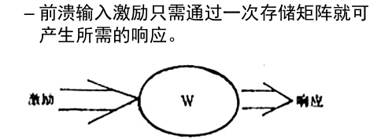

# 人工神经网络基础

[toc]

## 生物原型

所谓人工神经网络就是基于模仿生物大脑的结构和功能而构成的一种信息处理系统。 其中一些比较有价值的内容包括：

+ 不同层间神经元的链接方式：  平行型、发散型、收敛型和反馈型
+ 感受野：一个神经元的反应值取决于视觉领域很小一部分的强度分布，这个区域被称为神经元的感受野。 

## 特点

关于人工神经网络的定义： 其是一个并行、分布处理结构，由处理单元及其称为联接的无向讯号通道互连而成； 这些处理单元具有局部内存，可以完成局部操作，即它必须仅依赖于经过输入联接到大处理单元的所有输入信号哦的当前值和存储在它局部内存中的值；每个处理单元有一个单一的输出联接，输出信号可以是任何需要的数学模型。 

其工作过程是先训练学习，然后进行回忆操作。（也就是所谓的训练和推理操作） 

 对于人工神经网络的特点，应该为： 

总体而言，人工神经网络有一个固有的并行结构和并行处理，在结构上和处理顺序上都是并行的和同时的，在同一层内的处理单元都是同时工作的；并且，在人工神经网络中，知识是分布存储的，而非传统计算机方式，需要通过连接来获取； 并且人工神经网络具有很强的容错能力，主要是大脑中知识是存储在很多才处理单元和它们的连接上；并且人工神经网络具有自适应性，具有推理能力，处理从没见过的输入样本。 

总结一下，特点包括了：

+ 并行结构和并行处理
+ 知识的分布存储
+ 强容错力
+ 自适应性

而人工神经网络的局限性在于学习和训练往往是一个艰难的过程，需要大量的正确的训练数据（数据集上的困难） 和人工神经网络不适于高精度和类似顺序计数工作的计算。

## 发展历史

人工神经网络的第一次高潮在于：感知器模型和人工神经网络的出现。 而后进入了反思期，在于当时的简单感知有非常严重的局限性（无法解决异或问题）

第二次高潮在于Hopfield 网络模型的提出，解决了一系列问题，以及提出的多层网络的学习算法——BP 算法，解决了多层学习问题。

第三次，也就是在Hinton 深度学习概念之后，深层神经网络在图像和语音方面有了巨大的突破。  

## 基本模型

人工神经网络的基本处理单元，通常表示如下： 

其中处理单元的功能为： 对每个输入信号进行处理以确定其强度（加权）；确定所有输入信号的组合效果（求和）；然后确定其输出（转移特性） 

所以进一步表示处理单元应该为： 

### 转移函数（激活函数） 

激活函数的最核心作用是引入非线性因素，使得神经网络可以逼近任何非线性函数

其中比较常见的激活函数包括：线性函数，斜坡函数，阶跃函数，符号函数，sigmoid 函数，tanh 函数 和 ReLU 函数。 

其中ReLU 函数会使 一部分神经元的输出为-，这样减少了参数的相互依存关系，缓解了过拟合问题的发生；并且节省计算量，收敛较快。

## 拓扑结构

### 前馈型网络

单个处理单元可以处理简单的图形， 但更强的识别处理能力了来自多个结点“连城”人工神经网络。故有： 

一个需要注意的点在于： 在构成多层网络时，层间的转移函数（激活函数） 应该是非线性的，否则多层网络的计算能力并不比单层网络强。 （可以理解为矩阵乘法的操作） 

### 回归型网络（反馈网络） 

一般来说，凡包含反馈连接的网络均称为回归型网络，反馈网络。 

前馈性（非回归型网络）不需要存储记忆，输出只是由当前的输入和加权值确定；在反馈网络中，要将以前的输出循环返回到输入，输出不但取决于当前的输入，还要取决于以前的输出；反馈网络类似于人类短期记忆，是一类广泛应用的网络。

## 回忆与学习

存储是将信息直接存在存储器中，而回忆是将已存储的信息按照某种方式恢复出来

在人工神经网络中，图形的存储包括了两种，分别是内容寻址存储器（长期存储），另一种是联想存储器（短期存储）。 

### 回忆的概念

自联想变换，要求通过训练已在W中的存储向量来实现，由失真或缺损的向量来进行联想。 他联想变换，要求通过训练在W中的存储向量对（A,B）来实现，对于此，是从失真缺损的激励A 来获得B 的响应。 

除此之外，另一种分类方式是： 

前馈回忆和反馈回忆

### 训练

人工神经网络的最主要特征之一是它可以学习，通过训练把要做的事情存储在加权中。 学习的本质是加权矩阵随外部激励做自适应的变化。

训练的过程分为三步：构建网络——计算loss——输出最优解

#### 梯度下降算法

梯度下降算法收敛到稳定点较慢，但其比较有效和能够普遍应用。

#### 随机训练算法

利用了随机过程，用概率和能量关系来调节连接权，其基本思路如下： 

典型的随机训练算法为：模拟退火算法

#### Hebb 算法

上述两种方法是有指导的训练，这里给出一种无指导的训练算法。 其认为，如何源和目的神经元都被激活（抑制），他们之间的突触强度会增强。对此的数学描述可以为： 

#### Kohonen 算法

无指导的训练算法，在训练过程中，处理单元均参与彼此竞争，具有最大输出的处理单元是获胜者，获胜的节点具有抑制其竞争者的能力和激活近邻节点的能力。 

### 稳定性和收敛性

