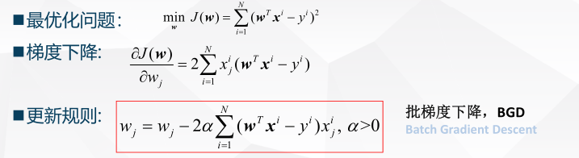

# 有监督学习方法

[TOC]

有监督学习就是从有标记的训练数据中学习推断函数，其目标函数为$Y = f(x) 或者 P（Y|X）$ ，对于有监督学习方法而言，主要分为产生式模型，判别式模型和判别函数。 

## 产生式模型

这种方法可以总结为： 首先对联合分布进行推断
$$
p(x,y) = p(y)p(x|y)
$$
然后利用贝叶斯定理来计算分布$p(y|x)$
$$
p(y|x) = \frac{p(x,y)}{p(x)} = \frac{p(y)p(x|y)}{}
$$
然后利用条件概率密度来进行预测

### 回归方法

回归问题应该定义为如下： 在给定输入和目标函数的情况下最小化损失函数，在梯度等于0 的情况下，所得到的权重为最优函数的解。 在线性情况下， 可以将回归问题理解为最小二乘问题。

在最小二乘方法下的梯度更新规则如下： 

其中，这种批梯度下降方法（BGD）， 其优点是一次迭代对所有样本进行计算，实现了并行，当目标函数为凸函数时，BGD 一定能够得到全局最优。 但其缺点在于当样本数目N很大时，迭代一步需要对所有样本计算，训练过程慢。

## 判别式方法

直接估计条件概率分布$P(y|x)$，根据估计的函数来确定输出（没有最初的对于联合分布的推断）

## 判别函数

也就寻找一个函数$f(x)$将每个输入映射到目标输出，概率不起直接的作用，而本质上$f$通常旨在近似条件分布$p(y|x)$，在这种情况下，概率是不起直接作用的。 

