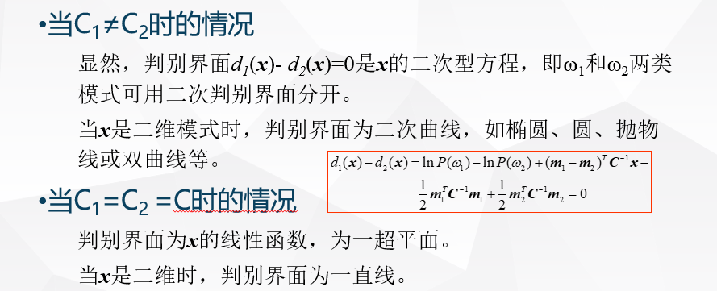
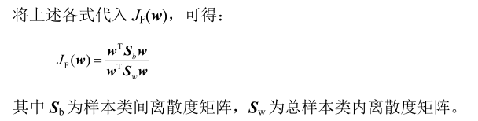
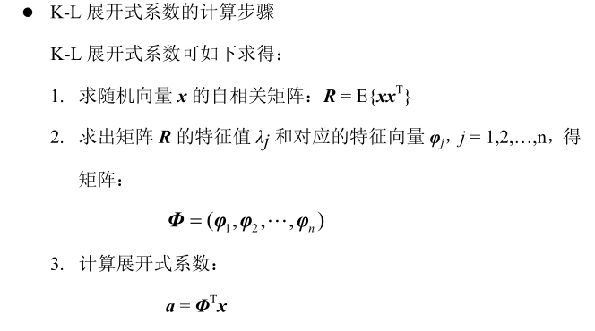
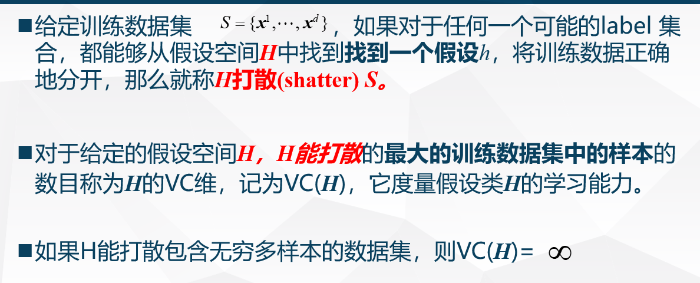
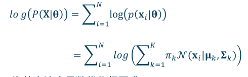
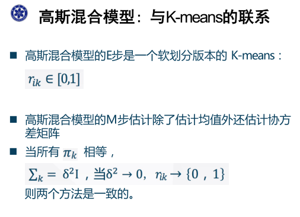

# 模式识别与机器学习 期末复习 all in one

[toc]

## 第二章 统计判别

### 贝叶斯判别准则

概率判别规则为： 

根据贝叶斯定理，那么就有： 

或者进一步改写： 

其中朴素贝叶斯是指在特征是多维向量时，其假设各个特征之间相互独立。 

### 最小风险判别

这里给出了条件平均风险的定义。在一些情况下，对于判定问题，不同的判定造成的风险是不同的，因此要把最小错误概率的贝叶斯判别做一些修正，提出条件平均风险： 

一般而言，对于其中的代价取值为： 

其表达式应该写为： 

主义这里公式的第二项在于将其判定为哪一类别。$w_j$类

对于多类情况，这里使用了一个标记，后续也会使用

$d_i(x) = p(x|w_i)P(w_i)$，则判定为：

### 正态分布模式的贝叶斯分类器

当设定类概率密度函数$p(x|w_i)$是多变量正态分布时，可以推导出一些简单的判别函数。

那么进一步得到其判别函数

对于两类问题而言： 

两个比较常见的估计量： 

对于这个估计量，对于在线计算中，也可能是迭代计算： 

#### 类先验分布参数估计

#### 类条件分布参数估计

## 第三章 判别函数

### 线性判别的原理

对于线性判别而言，之前就有所讨论。但这里有所不同，对于两类问题而言，其定义一个直线，对应有：

当然，上述内容也可以直接扩展到多类进行分析研究。直接将判别函数进行扩展即可

对于多类情况，有三种不同的判别情况： 

1. 判别情况1，用线性判别函数将属于$w_i$类的模式与不属于$w_i$类的模式分开 （这里显然需要 M 种 来区分 M类） 
2. 采用每对划分，一个判别界面智能分开两种类别（要分开M类模式，共需要M(M-1)/2 个判别函数）：
3. 是情况2 的特例

广义线性判别函数，是有效将非线性转化为线性的一种策略。 因此会有： 

后续又引入了分段线性判别函数来进行处理。 

模式空间是将x作为空间坐标来进行观测，而权空间则是将w 作为空间的标准（坐标）来进行观测。 

### Fisher 线性判别

Fisher线性的一个主要的思想就是降维，降低维数能够有效实现低维和高维空间中的勾连。 其思路是，将高维样本映射到一个可以区分的一维空间中（找到这个可以区分的一维空间）。根据实际情况找到一条最好的，最易于分类的投影线。 

将高维转换为低维，其基本为： 

本质上就是找到一个最佳的$w^*$来，下面开始介绍如何去寻找（首先明确fisher判别本质上就是一个降维算法，因此要考虑，最小化类内间隔，最大化类间距离）： 

根据上述定义，得到fisher 判别的最终形式为：

并以此求解，采用拉格朗日乘数法进行求解，得到：

### 感知器算法

感知器算法本质上就是对猜对的方法表示赞同，而对猜错的部分进行惩罚

可以统一写作，

（这里需要对不属于该类的样本进行处理） 

基于感知器算法的多类模式分类，是之前多类情况3 

感知器算法会因为初值的选择，C值的选择和误分类点的顺序选择的不同，而导致最终的判别函数的不同。 

### 经典迭代训练算法

梯度法通过选择准则函数，来对每个部分的内容求解梯度，然后进行更新。 另一种方法是固定增量，而非计算梯度来迭代更新。 

## 第四章 特征选择和提取

### 特征选择主要方法概念

特征选择和提取的目的是为了在尽可能保留信息的前提下，降低特征空间的维数。 

下面给出一些基本的度量标准

注意$S_w$和$S_b$的计算规则，上面的$m_0$是指上面？ 

### K-L 变换 （主成分分析PCA） 原理和流程

K-L变换就是一种适用于任意概率密度函数的正交变换，具体而言就是从n个特征中选出k个来反映原有模式。 

K-L展开式的根本性质就是将随机变量$x$展开为另一组正交向量$\phi$的线性和，且其展开系数为$a$

因此考虑对于正交向量集的确定，如下所示： 

实际上，这一内容本质上就是PCA算法，而之前是保持相等，后续的内容，就是尽可能接近并进行降维，那么就需要选择较大的特征值进行保留，而舍去较小的特征值的内容。 

## 第五章 统计学习理论基础

### 过拟合与正则化

过拟合也就是在给定的样本上分类得很好，但是在新的样本上效果不佳。 

为了不仅仅在训练样本上拟合得好，因此提出正则化来进行优化。

正则项是通过在原来的经验损失函数中添加一个惩罚项，不鼓励复杂的模型。 其中L2范数，也被称为岭回归。 这里需要区别L1 范数和L2范数之间对实际的影响效果。

### 泛化能力分析

可以将整体的期望的误差分为三个部分： 偏差，方差和噪声。 

其中第一项代表了偏差，$f_D(x)$代表了在数据集D上的预测函数，而$f(x)$代表了最优的函数。 偏差度量了预测的期望和真实结果的偏差结果，而方差表示了数据带来的扰动。 

其中，低方差意味着简单模型，而带来的就是高偏差，而高方差表示的是复杂模型，而带来的则是低偏差。 因此要注意偏差和方差间的权衡。 

其中泛化误差代表的是在新的样本上存在的误差，而训练误差是在训练中的误差。 

## 第六章 监督学习

生成式模型是通过先对联合分布进行推断，后利用贝叶斯定理来计算条件分布

而判别式模型是直接估计条件概率分布$P(y|x)$。

区分SGD 和 GD，其中GD 直接下降，但是计算量很大，而SGD 虽然是带噪声的下降，但计算量低。对于广义的线性回归而言，其利用一定的非线性基函数来处理线性的内容，以实现相应的特定优化。 

一些典型的基函数包括了多项式基函数，高斯函数和sigmoid 函数。

### 判别式分类模型：逻辑回归 LR （logistic regression)

可以看到，LR 作为一种典型的判别式模型，是直接去评估后验概率的，而非从联合概率到后验概率的传导过程。

而对于多类LR回归，利用softmax 来替代logistic sigmoid，得到其结果为

### 生成式分类模型

#### 高斯判别分析 GDA

GDA 使用多变量正态分布对$p(x|y)$进行建模，有： 

对其进行log 似然，得到最终的结果有： 

这里实际上先给出了y的分布，然后给出x 的特定分布，利用贝叶斯定理：

$p(y|x) = \frac{p(y)p(x|y)}{p(x)}$

将GDA 和 LR 进行比较，可以得到如下的结果： 

GDA 有很强的模型假设，而LR 假设比较弱，在实际中，LR 是更常用的模型。 

#### 朴素贝叶斯分类器

朴素贝叶斯的假设为： 在给定y时，样本的特征分量相互独立（特征的分量是独立的，不相互影响的） ，故应该有如下的结果： 

因此，对于给定的训练数据，其对数似然为： 

因此可以得到最终的概率估计可以表示为： 

给定训练数据，利用MLE 估计变量的概率， 可以得到如下结果： 

最后，将朴素贝叶斯（NB） 和 LR 进行比较： 

### 参数估计

对于参数估计而言，可以从两个角度来看，分别是MLE 和 MAE。 

#### 极大似然估计 MLE

假设 存在这样的关系:
$$
y = f(x,w) + \varepsilon 
$$
其中应该有，$\varepsilon$是均值为0，方差为$\beta^{-1}$的高斯噪声，并且有：
$$
p(y|x,w,\beta) = N(y | f(x,w), \beta^{-1})
$$
这里实际上的假设是，在高斯噪声模型下，最小化平方误差与最大似然的解是相同的。（高斯噪声的假设） 

对上述结果求最大似然，对其进行改写，然后求导，就可以得到

结论为： 最大化似然相当于最小化平方误差之和， 最小二乘法实际上是在假设误差项满足高斯分布且独立同分布的情况下，使得似然最大化。 

#### 最大后验概率 MAP

最大后验概率 实际上可以和带正则化的LMS（最小二乘法）联系起来，以L2范数为例，其优化问题为： 

可以得到其闭式解为： 

并给出参数的先验为$p(w) = N(0,\lambda^{-1}I)$，为多变量高斯。 

后验概率依然是高斯分布，得到其内容为： 

这里主要是根据贝叶斯定理，$p(w|y) = p(y|w)p(w)/p(y)$

具体而言，对于两种方法进行一个对比，可以看到： 

## 第七章 支持向量机

### SVM 原型问题与对偶问题的形式化

首先需要定义函数间隔的概念： 

而对于一组样本而言，其函数间隔定义为所有样本中最小的间隔： 

而在函数间隔之上，还有一个几何间隔的定义为：

其中几何间隔具有不变性（不随着$w$的改变而改变），那么SVM 的基本思路就是最大化不同类之间的几何间隔。 

可以将问题进行进一步的转化，得到（这里直接给出了最小的几何间隔）： 

最终得到原问题如下： 

对于原始的问题而言，可以用现成的二次规划来进行求解（QP） 

对于拉格朗日对偶而言，其原问题和对偶问题相等的条件在于： 如果原问题是凸优化问题，且存在严格满足约束条件的$w$，那么有： 

逐步优化这一内容，得到对偶问题为：（其中拉格朗日函数为）

通过得到对偶问题的最优解，来得到相应的原问题的解：

这里$w$的求解是比较显而易见的，而对于$b^{*}$的求解，这里实际上是$b = y-w^Tx$而得到的。 

通过上面的分析，可以看到，只需要利用$a_i > 0$的那些样本（支持向量）来进行计算。

并且在上面的问题中，我们可以发现，最终得到的$f(x)$实际上是$w^Tx+b$，而这里的计算结果应该是： 

可以观察到的是，只需要计算$(x^i)^Tx = <x^i,x>$ ，因此引入了核技巧进行计算。 

在上面的讨论中，都是硬间隔的SVM，这里进一步进行优化，得到软间隔的SVM。

#### 软间隔

允许一些样本（离群点或噪声样本）违反原本的不等式约束条件：

对于软间隔的对偶问题，同样应该得到： 

那么对于软间隔SVM 而言，其对偶问题是：

这里最大的变化是$a_i$的约束有一定的变化，而实际上目标函数是没有变化的。根据其内容，求得最优解

对于软间隔SVM，其KKT条件有一定的变化，得到其结果为：

通过之前的分析，我们可以得到，对于SVM 问题的最优解，应该有：

可以观察到，实际上最终的结果就是这样的一个表示，如果直接对$x$使用非线性变换，那么计算的复杂性会很高，这里给出了SVM 的核方法，设为：
$$
K(x^i, x^j) = (\phi(x^i)^T\phi(x^j))
$$
对于非线性SVM 而言，其只需要利用核技巧来进行计算，其对偶也就变成了：

核方法的优势在于 ： 线性方法解决非线性问题。 

一些常用的核函数包括了：

1. 多项式核
2. 高斯核 

#### SMO 算法求解 （序列最小优化算法）

SVM 原问题是通过传统的凸二次规划方法来获得全局最优解，但是在数据集大的情况下，算法很慢，因此SMO 算法是一种快速求解SVM 对偶问题的方法。 

对其进行小结，应该有：

#### 支持向量回归 SVC

同样利用拉格朗日方法求得其对偶问题，并且对于非线性回归利用核方法进行处理，其中落在一个$\varepsilon$ 边界以内的，才是SVR 的支持向量。

而对于多类SVM 问题而言，可以考虑是一对多的情况，这些情况在前面的章节就有所讨论。 

本质上，VC 维度量了模型的复杂度：

## 第八章 聚类

对于聚类而言，需要明白的一点是其划分的原则： 类内样本距离小，类间样本距离大。总体而言，可以将聚类划分为两种不同的类型，分别是基于划分的聚类和层次聚类。 

### 经典聚类算法的基本原理和适用场景

#### K均值聚类

K-means 算法是一种经典的聚类算法，其初始化K个类中心，然后迭代进行求解，去最小化类内距离，然后进一步更新簇心来迭代性进行优化。 

一个需要回答的问题是，K-means 算法是否一定会收敛，具体而言，k-means 无法保证一定收敛，可能会在不同的聚类结果间震荡，但在实际过程中，这样的震荡是很少发生的。 并且所优化的目标J 是一个非凸的，不能保证收敛到全局的最小值，一般采用的方法是多次运行k-means 算法来进行优化。 

在k-means 中还有一些其他的假设， 首先是K值的设定，还有初始点的设置。例如k-means++ 中保持初始的质心彼此远离，实际上初始设置对于聚类结果会有一定的影响。 

需要了解到，K-means 的局限性： 

可以看到，k-means 的聚类结果，主要是球形的簇的结果，并且要较为均匀。 因此对于非凸，尺寸和密度有差别的分布，采用K-means 聚类并不能得到好的结果。 

对此会有一些改进方法，比如基于密度函数，比如将平均值换位中位数等，来处理一些不同的情况。 

其中k-means 最大的局限性为 假定簇为球形，并且每个簇的概率相等。 

#### GMM （高斯混合模型）

首先给出高斯分布的内容， 具体如下：

其基本假设在于，假设有K个簇，并且每一个簇都服从高斯分布。 

根据上面的描述，应该有效得到一个分布的具体参数$\theta$，那么对于利用MLE ，可以得到对应的结果为： 

然而这个函数的优化是困难的，无法有效的直接求导，所有的参数耦合在一起，因此给出一个新的内容：

隐变量or 从属度： 

带入得到优化结果为： 

也就是说，其实$\mu_k$可以通过这样一个从属度计算得到，其它部分同样可以得到：

然而，这里的从属度$\gamma(z_{ik})$同样是依赖于参数的，得到EM 算法，其计算过程为：

得到通用的EM算法为：

总体而言，EM算法是一种寻找含有隐变量的概率模型的最大似然解的通用技术。 

对比高斯混合模型与K-means 的联系

总体而言， 

对于GMM 算法而言，其可以用于非球形簇。 点到簇的从属关系是一个软分配关系（概率分配关系） 

#### 层次聚类

层次聚类不需要提前假定聚类的簇数，主要分为了自底向上和自顶向下两类。 一般而言，自底向上（凝聚式）的聚类算法是较为常用的聚类算法。 其根据不同的指标，有不同的合并方式： 

其限制是：一旦簇被合并或者拆分，过程不可逆，没有优化一个全局的目标函数（是一个贪心的策略），并且，对于噪声和离群点敏感，比较难处理不同尺寸的簇和凸的簇，对于成链的内容也难以进行分裂。 

#### 基于密度的聚类（DBSCAN）

一般而言，密度可以定义为给定半径内点的个数：

一些具有代表性的图， 来理解DBSCAN： 

得到DBSCAN 的优势和劣势：

其中DBSCAN 在密度变化和高维数据中表现不好 

## 第九章 降维

降维或嵌入是指将原始的高维数据映射到低维空间。 

多维缩放（MDS），给定空间中任意两个点的距离，点的精确坐标和维度是未知的，将这些点嵌入到一个低维的空间中，使得新的空间中点对之间的距离和原始空间中的距离尽可能接近。 其中投影到低维空间的形式不是唯一的。

给出MDS 的假定： 

在中心化中，实际上中心化过程相当于平移，并不会改变低维度之间的距离。具体算法为： 

但这里实际上距离基本不可能保持相等，只可能是最小化两者之间的差距。

首先需要理解MDS实际上是一种预处理方法，主要是为了实现中心化的操作。

### 线性降维： PCA 流程

对于线性降维而言，描述其一般形式为： 

实际上是通过点的变换来实现相应的处理操作。 而其目标就是最小化重建误差： 

对该内容进一步推导，可以得到这个最小平方误差和的大小与如下的矩阵的迹是相等的。 

从另一个角度来看，可以将PCA 的目标函数视作最大化方差，也就是寻找到一个方向向量使得数据投影其上后方差最大（方差大意味着容易区分） ，同样也会得到一样的目标：

对该内容进行求解，注意这里只关注W 的方向，不关注其大小，故有： 

所以本质上W 的列向量是$XX^T$的特征向量，只需要去求解该特征向量即可。具体的PCA 计算流程可以被表示为（第一步是中心化，然后计算$XX^T$的特征向量）： 

而对于原始维度很大的情况，可以利用SVD 来帮忙，通过高效的算法直接找到最大的D个特征值对应的特征向量。这样，最终的计算过程变成了

对PCA 方法进行一个小结： 

### 非线性降维： 核PCA基本概念

从上面的PCA 可以看出，PCA 方法是线性投影，不能处理高阶依赖关系。 一个基本的方法就是核PCA，也就是对x进行非线性映射，然后再进行降维处理。

那么对于核的选择变成了非常重要的问题。 而考虑原PCA问题，可以发现，原PCA 问题只需要对内积进行特征向量的计算，所以直接类似于SVM 的核方法，得到： 

因此，KPCA 算法只需要将原来推导过程进行一个简单的转换：

总体而言，KPCA 实现了 升维 和 降维 的辩证统一，非线性 与 线性的辩证统一。	

### 流形学习

流形式一个局部具有欧式距离性质的拓扑空间，可以近似任意高维空间的子空间。 

#### 全局嵌入 （代表性方法）

ISOMAP 算法是一种非线性降维方法，其基本步骤是： 

+ 构建邻接图
+ 计算最短路径
+ 构建低维嵌入

具体算法为： 

在ISOMAP 算法中有两个主要的计算瓶颈： 

#### 局部嵌入 （代表性方法)

关于全局嵌入方法和局部嵌入方法之间的比较： 

可以看到，主要有LLE 和 LE 两种主要的局部嵌入方法。 

其中LLE 假设流形在很小的局部邻域内是近似线性的，所以邻域内任意一点，都可用局部近邻点来线性表示。 

其优缺点分别为： 

而LE （拉普拉斯特征映射） 的计算过程为： 

这里给出了KNN 的多种计算方法。 

#### tSNE 方法

首先需要认识随机邻域嵌入方法，给定高维空间中的N个数据点，之间的相似度用以数据点$x_i$为中心点的高斯分布表示。其基本思想在于，高维空间中相似的数据点，映射到低维空间也相似。 

这里是用t分布来描述相似度。 

具体而言，SNE 代价函数更关注局部结构，而t分布会兼顾全局结构。

t-SNE 主要用于可视化，很少用于降维，其有很多缺点。 

## 第十章 半监督方法

### 半监督学习的常用假设

半监督学习中的常用假设包括了平滑假设，聚类假设和流形假设。 

平滑假设，是指如果高密度空间中两个点距离近，对应的输出也接近

聚类假设： 如果两点在同一个簇，那么它们可以属于同一个类

流形假设： 高维数据大致会分布在一个低维的流形上，邻近的样本拥有相似的输出，邻近的程度常用相似程度来刻画

这里要区分好平滑假设和流形假设。 

### 常用方法的基本概念

#### 自我训练

自我训练的一个基本假设是： 输出的高置信度的预测是正确的。实际上也就是把高置信度的内容加入到标注数据中，重复进行训练。（每次添加一定的训练样本） 

自我训练是最简单的半监督学习方法，但是有一定的缺点： 

#### 协同训练

协同训练就是指的对于一个数据，从不同的特的角度来进行学习，两个分类器互相教对方。 其有一定的假设： 

得到的协同训练算法为： 

其自然也有一定的优点和缺点： 

#### 多视角学习

协同训练是多视角学习中的一个特例，整体的多视角学习是指： 

多视角学习在学习过程中，实质上是搜索最好的分类器，强迫多个分类器的预测一致性， 减少了搜索空间。

#### 基于GMM 的生成模型

将生成模型用于半监督学习，其基本假设和求解目标应该为： 

其中，以GMM 的生成模型为例，应该有可以使用EM 算法来计算高斯混合模型： 

实际上可以将其看作是自我训练的一种特殊形式。 

同样的，生成模型有一定的优点和缺点，其优点是： 

而其缺点是： 

#### S3VM(TSVM)

半监督支持向量机，其基本目标是，最大化所有数据的间隔。 

存在一个基本假设，来自不同类别的无标记数据之间会被较大的间隔隔开。

对于S3VM，其基本的目标函数有所变化： 

对于S3VM 目标函数而言， 其是非凸的，和SVM 目标函数是凸函数是完全不同的。

后面还介绍了基于图的算法和半监督聚类。 

基于图的算法，也就是通过图的传播来对无标签数据进行标记。而半监督聚类和无监督的聚类不同，其提供了一些基本的分类标签。

## 第十一章 概率图模型

概率图模型也就是用概率和结构来刻画我们的世界，进行推断与学习。 对于概率图模型，一般的表示方法为： 

有向图定义为$G=(V,E)$包含一个点集合V 和 一个边集合E，其中每条边为有序点对。 

### 有向概率图模型的表示

一般而言，用有向图模型可以表示因果关系，通过观察子变量并去推断出父变量的分布。

一个典型的有向概率图模型 是 贝叶斯网：

一个概率图模型对应着 一族概率分布，其每个节点对应着一个联合分布：

这里给出了联合概率的计算方式，其中贝叶斯网使用一系列变量间的“局部”关系“紧凑”地表示联合概率分布。  

三种经典的有向概率图： 

### 条件独立性判断

对于概率图模型，其条件独立性表示为：

一个计算例子是： 

这里表示了，在给定$x_2$的情况下，$x_4$与 $x_1, x_3$是独立的。

在条件独立检验中，给出一些描述内容：

可以通过这样的规则来检验条件独立，有点每太看懂这一部分的解释： 

对无向图模型也进行一定的总结： 

概率图模型是一个表示紧凑的概率分布的模型，以概率图M为例，其描述了唯一的概率分布P。 对于概率图，主要有两个基本的任务： 

在推断中，有两种主要的推断方法，分别是精确推断和近似推断： 

#### 变量消去法

#### 信念传播算法

### 隐马尔科夫模型（HMM）的原理、Viterbi 解码

HMM 是建模序列数据的图模型，是混合模型的一种推广；顶层节点表示隐含变量$y_t$，底层节点表示观测变量$x_t$。 

上面的符号规定实际上是一种one-hot 编码形式。 

其中需要注意的是，条件独立意味着的是，给定状态$y_t$，则状态$y_{t-1}$ 和$y_{t+1}$是独立的。而给定输出节点，不带来任何的条件独立性（给定任何观测变量） 

对于HMM 而言，有三个基础的问题，分别是： 

可以看到，实际上x是可以观察到的， 而最终需要评估的是状态序列以及原本的模型内容。其中的第一个任务就是推断任务。

对于推断问题的求解，其利用独立性和贝叶斯规则，可以进行计算任务。 

根据上面的结果，可以有如下的计算； 

所以这里给出了Viterbi 解码的内容，其要求为： 

## 第十二章 集成学习

### 偏差与方差分析

### 欠拟合与过拟合的判断和改进

### Bagging 原理

### Boosting 原理

## 第十三章 深度学习

### 神经元基本模型

### 常用激活函数及其特性：Sigmoid ReLU

### 卷积神经网络CNN原理

### 深度网络参数训练技巧

### 深度模型避免过拟合的策略