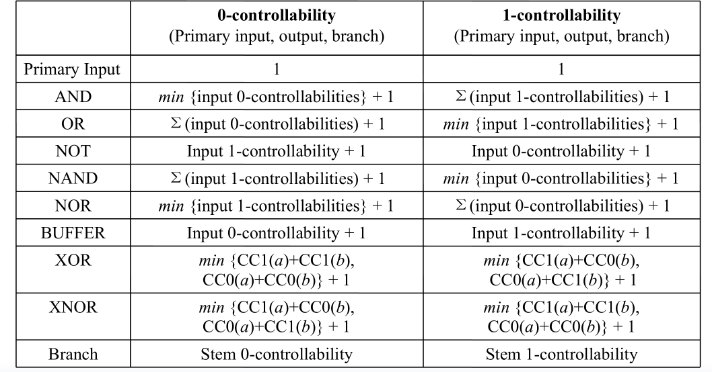

# VLSI 测试与可测试性分析 

## 第一章 VLSI 测试技术导论

### 良率和拒绝率

对于良率和拒绝率的计算方法，并且，在实际过程中，还可以用错误覆盖率来串联两者

### 错误模型

#### 可能的错误类型的计算： 

在其中，还有一个重要的概念，也就是等价错误： 

等价错误： 对于所有的input patterns，不同的single fault 体现出现来的结果是相同的。

fault collapsing（取消错误的混淆）： 1. 消除等价错误，就可以定位到实际的错误 2. 减少错误的个数

#### Stuck-at Faults

也就是某一个或者多个位置卡在了0 或者 1 上，固定不变。 有两种不同的类型（SA0 和 SA1），可以根据此来生成真值表并进行处理

## 第二章 可测试性设计

### 可测试性设计技术

其中包括了两种方式，一种是基于拓扑的可测试性设计，另一种是基于仿真的可测试性设计。

#### 基于拓扑的可测试性设计

##### SCOAP

SCOAP 包括了两个重要概念： 

1. 可控制性： 反映了从输入开始，要设置一个值为固定值的难度
2. 可观测性： 反映了从逻辑值推到最终的输出结果的难度

因此需要计算这样六个内容： 

可控制性的值是从1到无穷，而可观测性的值是从0到无穷。注意S是针对于时序逻辑，而C 是针对于组合逻辑的。一般来说，会考的还是组合逻辑居多。

对于所有的输入，其CC0 和 CC1 都设置为1 ，而SC0 和SC1 都设置为0， 而对所有的输出，其CO 和 SO 值都设置为0 		

对于SCOPE 传播中的计算，有如下的规则 （记得打印规则），其中注意stem 的结构： 

**对时序逻辑有一定的计算规则，规则比较复杂，这一部分的计算不是很清楚！**

###### levelization algorithms

可以利用此来进行计算，是比较重要的内容！！！

##### 基于概率的可测试性分析

利用概率来进行相应的表示，主要是计算随机可测试性。 

其具体计算规则为： 

#### Test point insertion

这一部分没太看懂，不是很明白是什么意思。 

#### Structure Approach

三种不同的模式： normal mode, shift mode 和 capture mode。 

一个scan 设计包括了两个部分： data input 和 scan input， 并且，在normal 和 capture mode 下， data input 被用来更新output， 而在shift mode 下， scan input 被用来更新output。 

##### Muxed-D SCAN Cell 

这个scan cell 包括了一个D 触发器和一个多路复用器

这个内容实际上使用了一个使能信号SE来选择data input 或者 scan input 。 SE 设置为0，则是normal 或者capture 模式。 SE 实际上是控制shift mode 和其余两个的划分，而TM 信号则是test mode 信号，是将normal mode 和其它两个模式分开。 

#### 扫描测试

对于扫描测试而言，主要有三种不同的测试方式，包括了full-scan，partial scan 和random-scan 

##### full-scan 扫描测试

所以实际上Mux-D full scan 也是能够很好被理解的，如下图所示： 

改为full-scan 的 测试结果，为： 

其中，不同的符号的不同概念为： 

