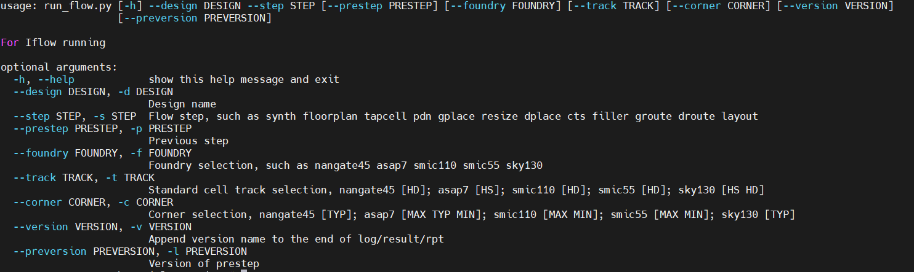

<div class="cover" style="page-break-after:always;font-family:方正公文仿宋;width:100%;height:100%;border:none;margin: 0 auto;text-align:center;">    <div style="width:60%;margin: 0 auto;height:0;padding-bottom:10%;">        </br>            </div>    </br></br></br></br></br>    <div style="width:60%;margin: 0 auto;height:0;padding-bottom:40%;">            </div>    </br></br></br></br></br></br></br></br>    <span style="font-family:华文黑体Bold;text-align:center;font-size:20pt;margin: 10pt auto;line-height:30pt;">《高级计算机体系结构 课程实验报告》</span>    </br>    </br>    <table style="border:none;text-align:center;width:72%;font-family:仿宋;font-size:14px; margin: 0 auto;">    <tbody style="font-family:方正公文仿宋;font-size:12pt;">       <tr style="font-weight:normal;">             <td style="width:20%;text-align:right;">授课教师</td>            <td style="width:2%">：</td>             <td style="width:40%;font-weight:normal;border-bottom: 1px solid;text-align:center;font-family:华文仿宋">沈海华 </td>     </tr>        <tr style="font-weight:normal;">             <td style="width:20%;text-align:right;">姓　　名</td>            <td style="width:2%">：</td>             <td style="width:40%;font-weight:normal;border-bottom: 1px solid;text-align:center;font-family:华文仿宋"> 刘炼</td>     </tr>        <tr style="font-weight:normal;">             <td style="width:20%;text-align:right;">学　　号</td>            <td style="width:2%">：</td>             <td style="width:40%;font-weight:normal;border-bottom: 1px solid;text-align:center;font-family:华文仿宋"> 202128013229021 </td>     </tr>        <tr style="font-weight:normal;">                  <tr style="font-weight:normal;">             <td style="width:20%;text-align:right;">日　　期</td>            <td style="width:2%">：</td>             <td style="width:40%;font-weight:normal;border-bottom: 1px solid;text-align:center;font-family:华文仿宋">完成日期</td>     </tr>    </tbody>                  </table></div>


#  高级计算机系统结构 课程实验报告

<center><div style='height:2mm;'></div><div style="font-family:华文楷体;font-size:14pt;">刘炼，202128013229021 </div></center>
<center><span style="font-family:华文楷体;font-size:9pt;line-height:9mm">中国科学院大学 计算机学院  </span>
</center>
## Build iFlow & Run Example 

```bash 
git clone https://github.com/PCNL-EDA/iFlow.git   
cd iFlow
./build_iflow.sh  # 在 build_iflow 中，存在很多 sudo 权限的内容，实际上应该删去改内容

```

> 整个项目目录如下所示： 
>
> 
>
> 

### 基本执行流程

#### run_flow.py 

运行`./run_flow.py -h ` ，可以得到如下的说明：



可以看到，通过选择不同的参数，可以设置不同的RTL 设计 （-d design) , 后端设计的不同步骤 （-s step) 等内容。 

#### configuration

在`iFlow/scripts/cfg` 文件夹中，包含了四个脚本文件： `data_def.py`, `flow_cfg.py`, `foundry_cfg.py` 和 `tools_cfg.py`，分别用来控制数据的定义， 流程配置，工艺库配置以及工具版本的配置。 


在`data_def.py`中，如上图所示，蓝框标识了后端的不同步骤，并且设置了每个步骤所使用的工具，可以更改这些工具内容。
