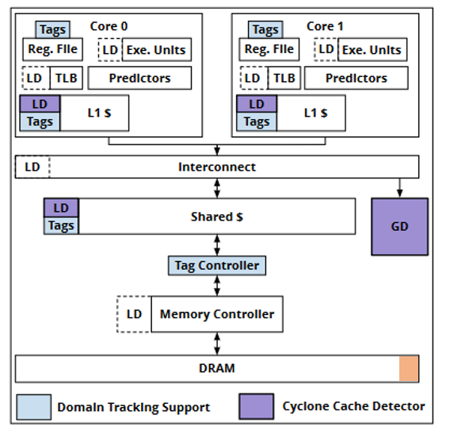

# 体系结构安全课程报告 —— 第七组

Cyclone: Detecting Contention-Based Cache Information Leaks Through Cyclic Interference  
    学号： 202128013229021                 姓名：刘炼

## 文章的优缺点分析

### 优点分析

####  统一性的 循环干扰 特性

文章提出了一个统一性的循环干扰特性，能够描述各类 contention-based 缓存信息泄露的问题。文中主要以两种常见的攻击模式 （Prime+Probe 和 Flush+Reload） 为例， 说明了循环干扰特性能够对这两种攻击都检测到。 这样一种统一性的检测模式，能够有效解决多种contention-based 的缓存泄露攻击，是本文的一个主要贡献点。

#### false-positive 分析

在本文所设定的防御模式中，不仅仅只考虑了如何精准检测攻击模式，也注重对于假攻击的识别，也就是对于false-positive 的分析。在实际中，大量的false-positive 的错误，会导致很大的性能损失。 相比于之前的基于检测的工作，本文所提出的模式能够有效避免false-positive 错误，从而在很大程度上减小了硬件在防御时产生的额外开销，使得其性能损失不会过大。

#### 粗细粒度的统一检测

除了考虑传统的粗粒度的检测之外，本文还考虑了对于细粒度场景下（例如浏览器）对于contention-based 缓存泄露攻击的防御策略。具体而言，粗粒度的隔离将安全域置于分散的地址空间，典型的有MMU。 而细粒度的隔离，多个安全域在同一线程生存期内，处于同一虚拟地址空间，使用动态绑定。 而本文考虑了在细粒度下的攻击，通过在地址位上的安全域的设置，能够检测到细粒度的攻击。 

#### memory tag 的迁移

本文使用了 tag  来标记 cache 和 resource (register)，而通常这种tag 是用来对于memory 的内容进行标记的。 这篇文章首次将这种tag标记的方式使用到了对于cache  line 和 resource 的标记上，是一个跨域的突破。 

###  缺点分析

#### 硬件结构复杂

如图给出了本文所提出的硬件架构，相对于传统的架构而言，本文所提出的架构在各级cache 中都有一个TAG 和LD ，其需要增加很多的硬件单元来实现相应的内容。 除此之外，本文所提出的架构需要修改DRAM 中的内容，同样需要为其进行tag 的标识，显然，这样的硬件开销是很难接受的。 

#### GD 的分类器

可以注意到，本文中最终对所检测到的模式需要进行分类来判断其是否为攻击，而这里提出，在GD 中使用一些常用的ML 分类器来进行分类，例如SVM, CNN 等。在本文中，主要使用的是单分类的 SVM 分类器，其存在的问题包括 SVM 训练，需要一些额外的数据，以及SVM 的执行也需要耗费不少的时间。 

## 对体系结构安全发展的启示

### 统一性的检测描述

本文的一个重要贡献点在于提出了循环干扰这样一种统一性的攻击模式，通常而言，不论是对于攻击还是防御者而言，都希望捕捉到一种统一性的模式，以便于相应的攻击和防御。对于攻击方而言，例如像Meltdown 此类的攻击，都遵循类似的攻击模式，而对于防御方而言，如果能够有效捕捉到一个特定的攻击模式，那么其防御策略的设置就能更加有效，并且易于扩展。

### 跨域的扩展

本文另一个突出的贡献在于使用了 tag 标记的策略来追踪 domain 的内容，实际上，正如之前所讨论那样，tag 标识通常是用于memory 中，但是这里给出了一种新的用法。本文借用了在其它领域的思路来解决contention-based 缓存信息泄露的攻击问题，为后续的工作给出了一种新的启发。

## 存在的不足

### 硬件可实现性的困难

在上述讨论中，我们已经说明了本文所给出的架构设计，在实际的硬件中很难实现。虽然本文在模拟器上的评估表明，其所带来的性能损失不会很大，但实际上，通过在各级cache 和 内存中添加额外的控制逻辑和计算单元，会造成额外的计算开销，从而极大影响到实际系统的性能。

### 无法防御 Flush-Flush 攻击

在后续的一个工作中，有人指出Cyclone 无法防御Flush-Flush 攻击，这种攻击模式，不会产生本文所给出的循环干扰的结果，因为相较于其它的攻击模式，Flush-Flush 攻击并不能通过标志tag 来得到循环模式。但值得注意的是，虽然直接采用Cyclone 无法实现相应的防御， 通过扩展cyclone 的tag 标志的方式，实际上还是能够实现Flush-Flush 攻击的检测的。

### 借助于分类器，对特定攻击模式受限

本文所给出的检测方式，基于了GD 中所训练的分类器，这种基于训练的分类器，有两个较大的缺陷，其一是由于GD 是可编程的，允许用户根据安全需求选择自己的分类器，如果在训练过程中，攻击者构造后门或者制造一些对抗性扰动导致误分类，可能会降低检测成功率。其二是由于对于一些分类器而言，其执行时间较长，从而会影响到整体的性能。并且要添加特定的硬件支持相应分类器的推理，需要大量的硬件资源。