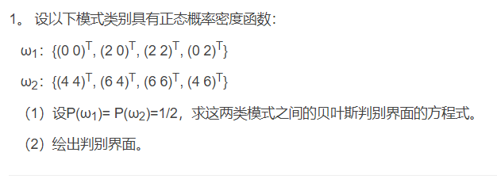
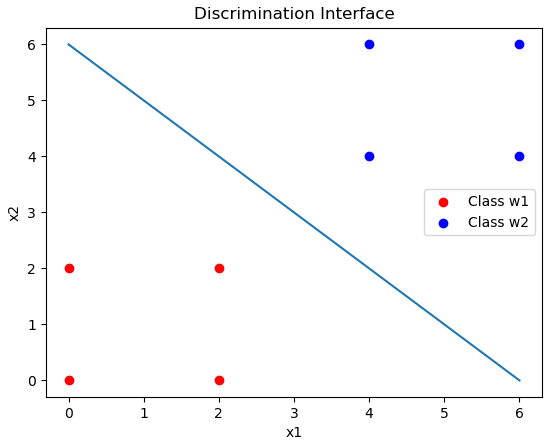

（1）

设$P(x|w_i)$ 的分布为一个高斯分布，根据所给出的数据，对均值和方差进行估计，应该有： 

1. 对$P(x|w_1)$，有 
   $$
   \hat{m_1} = \frac{1}{N}\sum_{i=1}^N x_i = (1,1)^T \\ 
   \hat{C_1} = \frac{1}{N}\sum_{i=1}^N (x_i - \hat{m_1})(x_i - \hat{m_1})^T = \left[
   \begin{matrix}
   1 & 0 \\
   0 & 1
   \end{matrix}
   \right]
   $$

2. 同理，对$P(x|w_2)$，有 
   $$
   \hat{m_2} = \frac{1}{N}\sum_{i=1}^N x_i = (5,5)^T \\ 
   \hat{C_2} = \frac{1}{N}\sum_{i=1}^N (x_i - \hat{m_2})(x_i - \hat{m_2})^T =  \left[
   \begin{matrix}
   1 & 0 \\
   0 & 1
   \end{matrix}
   \right]
   $$
   

其中，判别界面应该为 ，由于$C_1 = C_2$， $P(w_1) = P(w_2)$
$$
\begin{align}
d_1(x) - d_2(x) &= lnP(w_1) - \frac{1}{2}ln|C_1| - \frac{1}{2}(x-m_1)C_1^{-1}(x-m_1)  \\ &- lnP(w_2) + \frac{1}{2}ln|C_2| + \frac{1}{2}(x-m_2)C_2^{-1}(x-m_2) \\ 
 &= (m_1 - m_2)^TC^{-1}x - \frac{1}{2}m_1^TC^{-1}m_1 + \frac{1}{2}m_2^TC^{-1}m_2 \\
&= [-4, -4] x + 24 
\end{align}
$$

