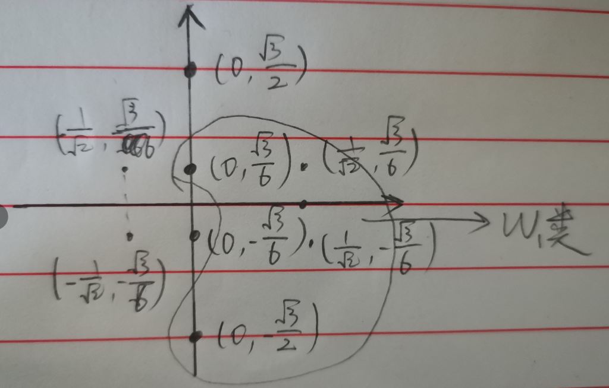

# 第四章作业

学号： 202128013229021  姓名： 刘炼

### 题目一

根据题目，可求得，三个不同类的均值向量分别为： 
$$
m_1 = (\frac{4}{3}, \frac{1}{3})^T \\ 
m_2 = (-\frac{2}{3}, \frac{2}{3})^T \\ 
m_3 = (-\frac{1}{3}, -\frac{4}{3})^T \\
$$
且有： $P(w_1) = P(w_2) = P(w_3) = \frac{1}{3}$

所以，多类模式的总体均值向量为: 
$$
m_0 = E(x) = \sum_{i=1}^3 P(w_i)m_i = (\frac{1}{9}, -\frac{1}{9})^T
$$
对类内距离和类间距离分别求解得： 
$$
S_w = \sum_{i=1}^3P(w_i)E\{(x-m_i)(x-m_i)^T\} \\ 
= \frac{1}{3}\frac{1}{3}\sum_{x_i\in w_1}\{(x-m_1)(x-m_1)^T\} + \frac{1}{3}\frac{1}{3}\sum_{x_i\in w_2}\{(x-m_2)(x-m_2)^T\} \\ + \frac{1}{3}\frac{1}{3}\sum_{x_i\in w_3}\{(x-m_3)(x-m_3)^T\} \\ 
=  \left(\begin{matrix}
\frac{2}{9} & -\frac{1}{27} \\ 
-\frac{1}{27} & \frac{2}{9}
\end{matrix}\right)
$$

$$
S_b = \sum_{i=1}^3P(w_i)(m_i-m_0)(m_i-m_0)^T \\ 
    = \left(\begin{matrix}
    \frac{97}{81} & \frac{13}{81} \\ 
    \frac{13}{81} & \frac{1}{3}
    \end{matrix}\right)
$$

### 题目2 

根据题目，两类模式中两类的概率相等，应该要$P(w_1) = P(w_2) = 0.5$，所以
$$
m = 0.5\times\frac{1}{4}(3,1,1)^T + 0.5\times\frac{1}{4}(1,3,3)^T = (0.5, 0.5, 0.5)^T
$$
这样的情况并不满足特征压缩的最佳条件，因此要进行变换

则，令变换后的向量为$t = x - m$

求解为； 
$$
R = \sum_{i=1}^2P(w_i)E(tt^T) = \left(\begin{matrix}
0.5 & 0.25 & 0.25 \\
0.25 & 0.5 & 0.25 \\
0.25 & 0.25 & 0.5 
\end{matrix}\right)
$$
解特征方程组$|R - \lambda I| = 0$ 

得到特征值为： $\lambda_1 = 1, \lambda_2 = 0.25, \lambda_3 = 0.25$

其对应的特征向量可由$R\varphi_i = \lambda_i \varphi_i$求得： 
$$
\varphi_1 = \frac{1}{\sqrt{2}}\left(\begin{matrix}
1 \\ 
-1 \\ 
0 \end{matrix}\right)
$$

$$
\varphi_2 = \varphi_3 = \frac{1}{\sqrt{3}}\left(\begin{matrix}
1 \\ 
1 \\ 
1 \end{matrix}\right)
$$

故当需要降到二维时： 

由$y=\phi^T t = \phi^T(x-m)$求解，变换后的二维模式特征为： 
$$
w_1 : \{(0 \ -\frac{\sqrt{3}}{2})^T, (\frac{1}{\sqrt{2}}\ -\frac{\sqrt{3}}{6})^T, (\frac{1}{\sqrt{2}} \  \frac{\sqrt{3}}{6})^T, (0 \  \frac{\sqrt{3}}{6})^T\}  \\
w_2 : \{(0 \ -\frac{\sqrt{3}}{6})^T, (-\frac{1}{\sqrt{2}}\ -\frac{\sqrt{3}}{6})^T, (-\frac{1}{\sqrt{2}} \  \frac{\sqrt{3}}{6})^T, (0 \  \frac{\sqrt{3}}{2})^T\}
$$
绘图为： 

由$y=\phi^T t = \phi^T(x-m)$求解，变换后的一维模式特征为： 
$$
w_1 : \{0, \frac{1}{\sqrt{2}}, \frac{1}{\sqrt{2}}, 0\}  \\
w_2 : \{0, -\frac{1}{\sqrt{2}}, -\frac{1}{\sqrt{2}}, 0\}
$$
绘图为： 

