# 量子信息与量子密码 

[toc]

## 量子力学基础

### 线性代数基础

酉矩阵是 复数形式下的正交矩阵，而厄米阵是 复数形式下的对称（共轭转置）矩阵，对于这种形式，存在奇异值分解，并有奇异值的定义。 

- [ ] 奇异值分解 和 极式分解
- [ ] 直积的定义 （最需要注意 转置 和 求逆过程 与传统矩阵乘法的不同） 
- [ ] 酉变换和酉矩阵
- [ ] 正规算子 与 谱分解 定理 
- [ ] 同时酉对角化
- [ ] Gram-Schmidt 正交化 
- [ ] 矩阵的外积表示
- [ ] 算子函数

### 量子力学基础

#### 基本假设

1. 波函数假设
2. 算符假设 
3. 测量假设
4. 态演化假设
5. 全同性假设

#### 基本概念

测不准原理（不确定性原理）

#### 量子测量

测量算子的完备性原则

#### 密度算符

密度算子的定义：（对于纯态系综）

系统完全由密度算子描述， 密度算子为作用在态空间上的半正定算子。 而量子力学的第二个基本假设表明一个闭的量子系统的演化是由一个酉算子 U 来刻画。

#### 复合体系

#### Bell 定理 （不等式）

## 量子信息论与早期量子算法

### 量子信息论简介

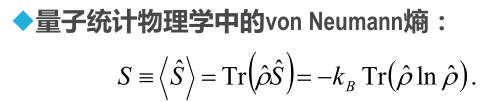

### 量子通信

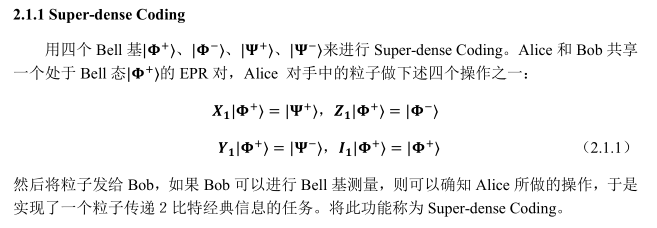

bell 态： 四个纠缠态

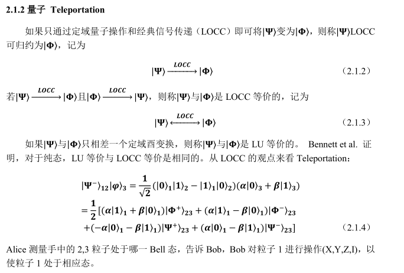

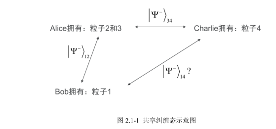

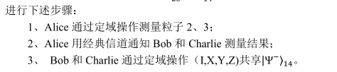

### 量子逻辑门

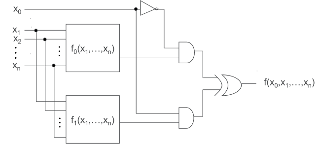

而可逆逻辑门，是指可逆的，通过输出可以推测输入

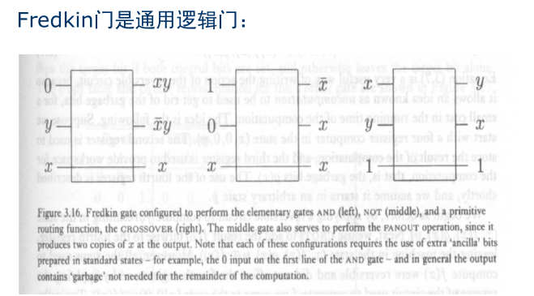

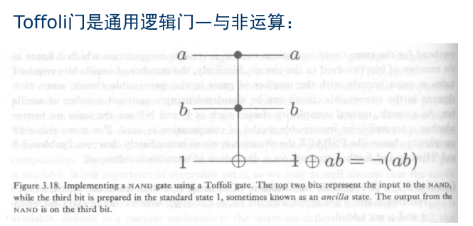

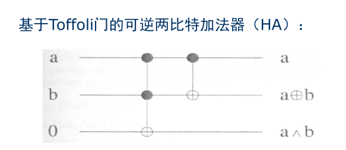

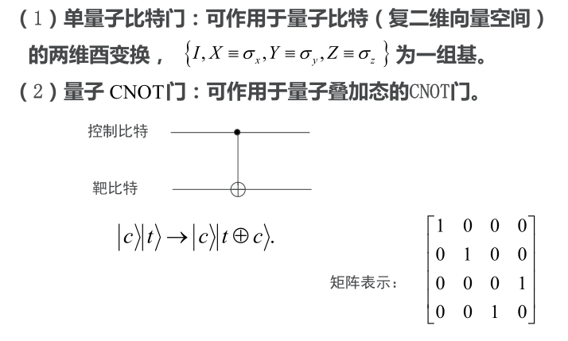

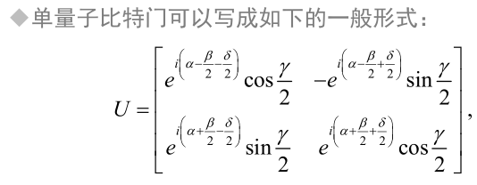

### 简单量子算法

查看PPT 

### 量子密码协议

## 量子计算模型

### 量子逻辑线路

#### 经典逻辑门和可逆逻辑门

有一些基本的逻辑门，而在量子中，也存在一定的基本逻辑门： 

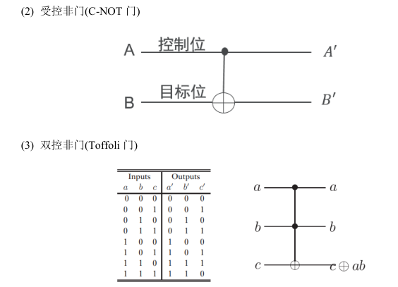

最经典的就是受控非门（CNOT）

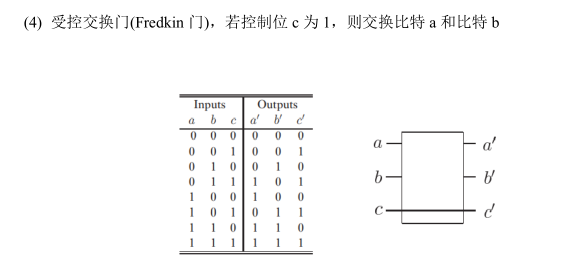

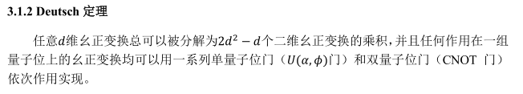

而对于单 qubit 操作而言，主要有X,Y,Z和 H 门等

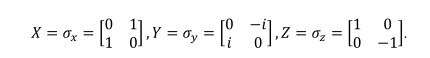

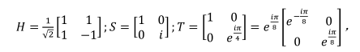

那么，关于x,y,z轴旋转算子分别定义如下：

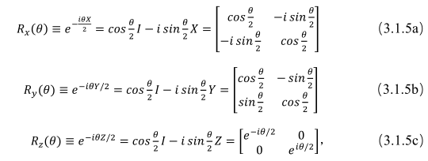

那么任意一个单量子比特的酉变换，都可以分解为： 

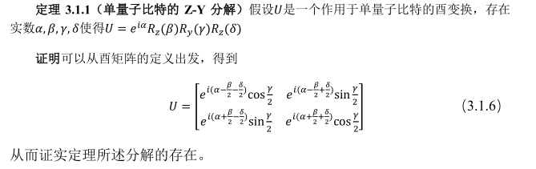

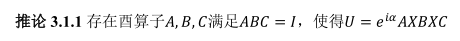

#### 受控运算

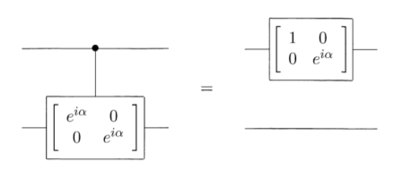

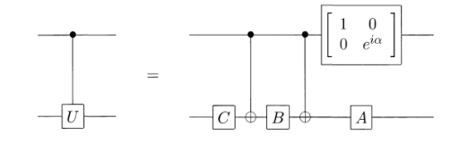

#### 量子线路的测量问题

隐含测量问题： 

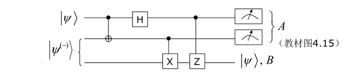

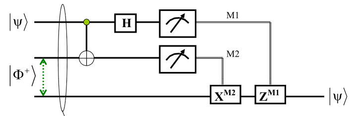

纠缠态（贝尔态）的制备

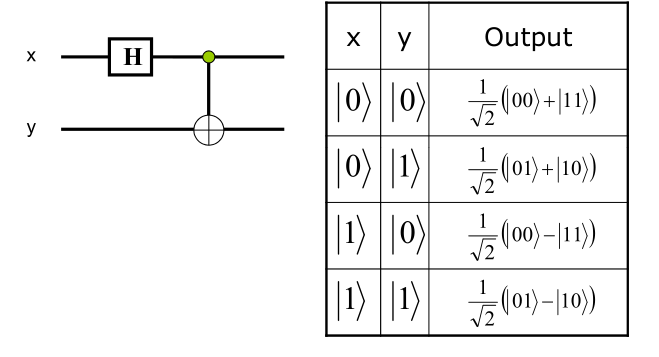

##### 通用运算的有效离散集合

**两级酉门**

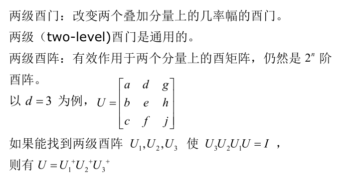

