# 量子信息与量子密码 

[toc]

## 量子力学基础

### 线性代数基础

酉矩阵是 复数形式下的正交矩阵，而厄米阵是 复数形式下的对称（共轭转置）矩阵，对于这种形式，存在奇异值分解，并有奇异值的定义。 

- [ ] 奇异值分解 和 极式分解
- [ ] 直积的定义 （最需要注意 转置 和 求逆过程 与传统矩阵乘法的不同） 
- [ ] 酉变换和酉矩阵
- [ ] 正规算子 与 谱分解 定理 
- [ ] 同时酉对角化
- [ ] Gram-Schmidt 正交化 
- [ ] 矩阵的外积表示
- [ ] 算子函数

### 量子力学基础

#### 基本假设

1. 波函数假设
2. 算符假设 
3. 测量假设
4. 态演化假设
5. 全同性假设

#### 基本概念

测不准原理（不确定性原理）

#### 量子测量

测量算子的完备性原则

#### 密度算符

密度算子的定义：（对于纯态系综）

系统完全由密度算子描述， 密度算子为作用在态空间上的半正定算子。 而量子力学的第二个基本假设表明一个闭的量子系统的演化是由一个酉算子 U 来刻画。

#### 复合体系

#### Bell 定理 （不等式）

## 量子信息论与早期量子算法

### 量子信息论简介

### 量子通信

bell 态： 四个纠缠态

### 量子逻辑门

而可逆逻辑门，是指可逆的，通过输出可以推测输入

### 简单量子算法

查看PPT 

### 量子密码协议

## 量子计算模型

### 量子逻辑线路

#### 经典逻辑门和可逆逻辑门

有一些基本的逻辑门，而在量子中，也存在一定的基本逻辑门： 

最经典的就是受控非门（CNOT）

而对于单 qubit 操作而言，主要有X,Y,Z和 H 门等

那么，关于x,y,z轴旋转算子分别定义如下：

那么任意一个单量子比特的酉变换，都可以分解为： 

#### 受控运算

#### 量子线路的测量问题

隐含测量问题： 

纠缠态（贝尔态）的制备

##### 通用运算的有效离散集合

**两级酉门**

## 纠错码与容错量子计算

### 编码理论基本概念

#### 编译码概念

编码过程是 m 位二进制数 到 n 位 二进制数的转化

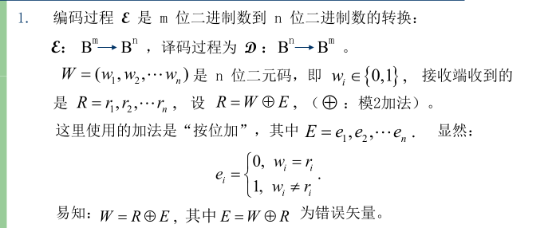

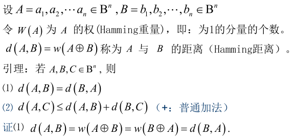

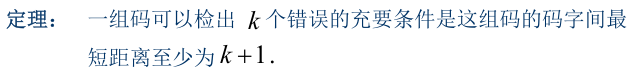

标准的生成矩阵

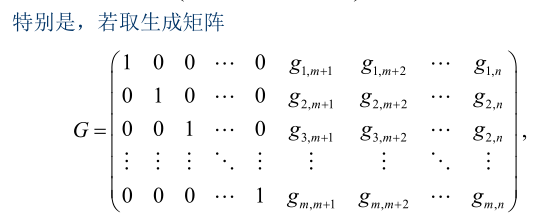

通过编码可以有效实现纠错内容

其具体纠错过程是：通过生成矩阵G ，可以得到校验矩阵H， 其满足如下表达式： 

$HW^T = 0$, 其中 $W = AG$, 那么如果存在出错，即： $HR^T \neq 0$，那么R 就不是码字，故假设有： $R = W + E$ ，所以： 

$HR^T = HE^T$，根据设定，可以取得E ，那么就可以求得 $W$.

#### hamming 码

从校验矩阵来构造hamming 码，可以得到hamming 码

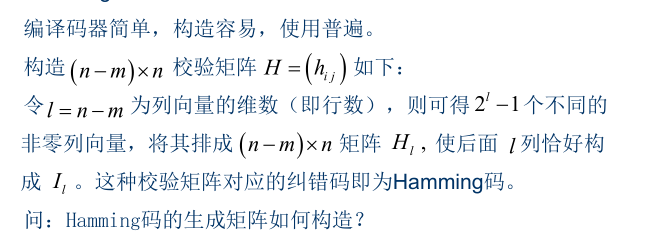

hamming 码是一个完全码： 

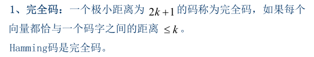

### 量子纠错码

量子码所面临的问题在于： 错误类型不同，除了比特反转之外，还有相位反转。 并且纠错过程不能直接对数据态进行测量。 

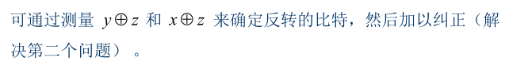

通过特定的有效编码来实现其具体的检测过程。

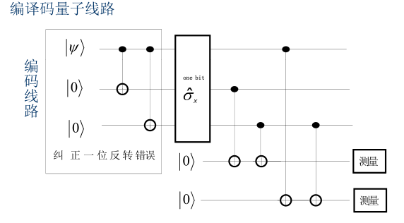

第二种思路是直接用量子电路修正错误，不需要判定其原来结果： 

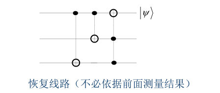

上面两个系统而言，其具体而言，是解决了所给出的第二个问题，而第一个问题是纠正相位错误，其解决方式如下： 

实际上相位反转是共轭基上的比特反转，所以其解决方式是较为简单的，实际上是将相位错误变为比特错误，然后使用上面的比特错误解决方式来解决相位反转的错误。

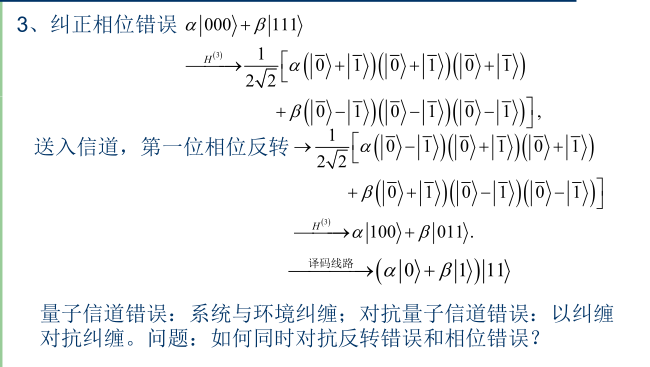

#### Shor 码

其编码方式就是通过给定编码的扩展，其具体编码电路如下：

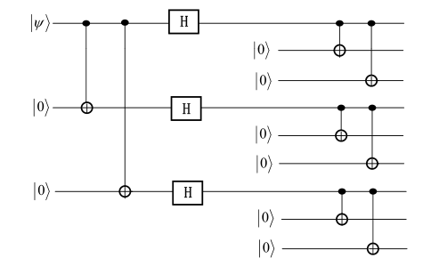

可以看到，实际上使用了9个量子位来实现一个量子位的纠错。 

#### CSS 量子纠错码

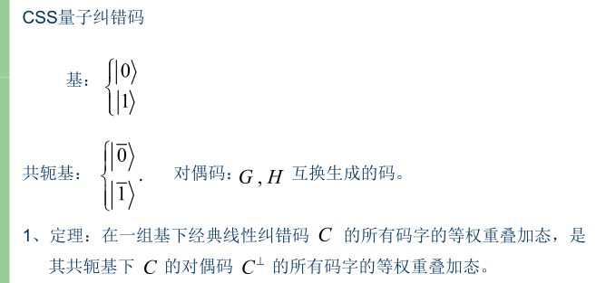

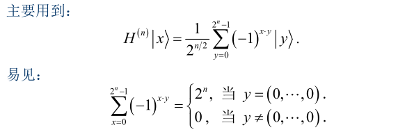

可以看到，通过求和的结果，可以描述出 $y$ 的内容。

具体的 CSS 码的纠错过程如下：

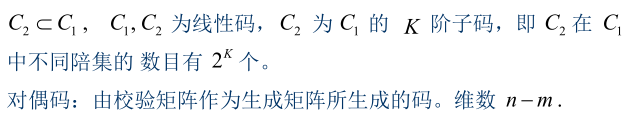

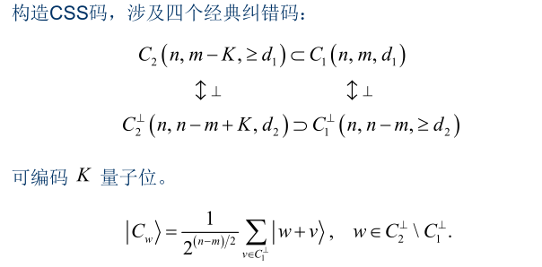

得到最终的一个CSS 码 纠错实例为： 

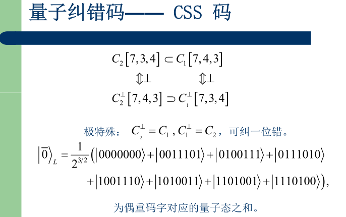

其得到的结果为：

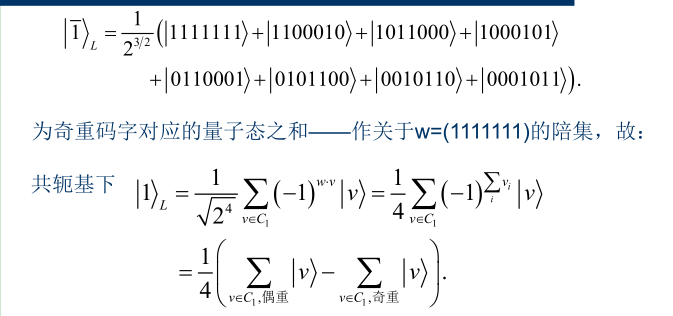

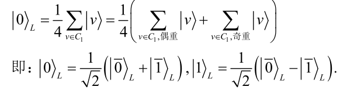

通过 物理位 上的 逐位变换 变成了 逻辑位 上的阿达玛 变换。 

#### steane 就是上述 CSS 编码的具体实例

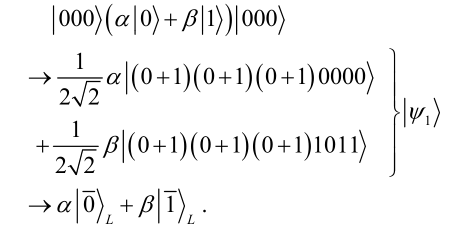

## 量子算法

### Shor 算法

#### 量子Fourier变换 (QFT)

对标经典离散Fourier 变换，在量子清醒下也可以得到具体的定义： 

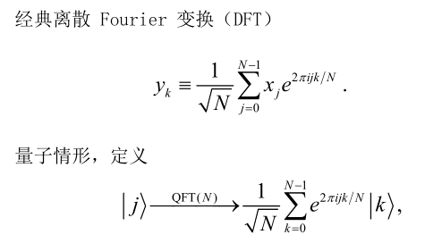

因为整体的量子状态，可以分解为多个量子状态之和。上面的内容将量子和经典结合起来

要探究两个内容，第一个是说明QFT 的酉性： 

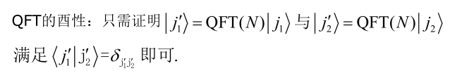

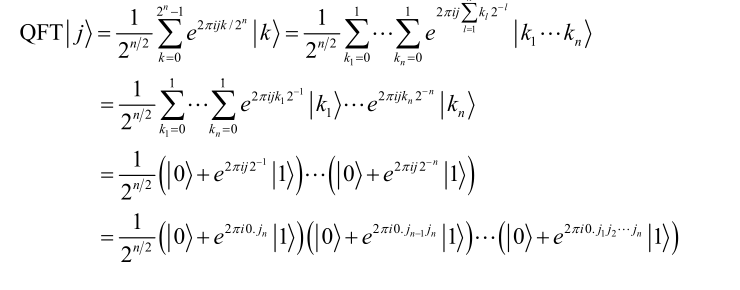

通过这一表述，可以说明，实际上就是一个对N个内容的操作，所以得到最终的电路为：

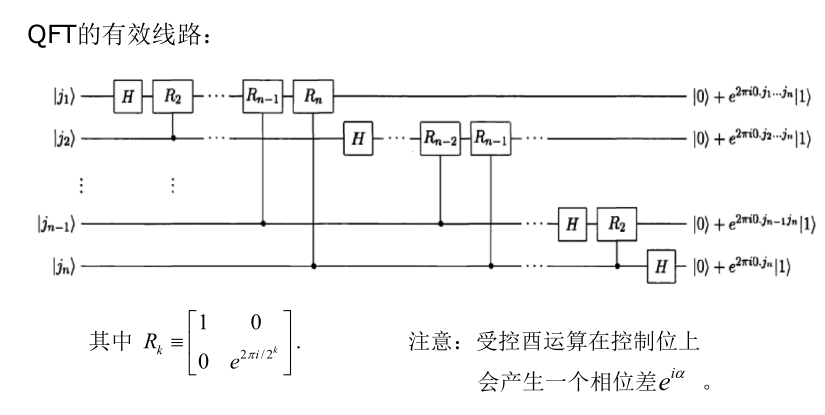

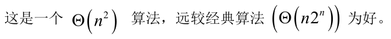

#### 相位估计

这是量子傅里叶变换的一个应用， 实现相位的估计。 

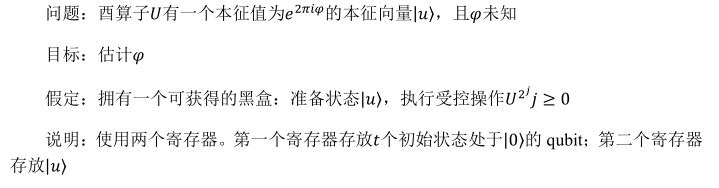

具体第一阶段的运行图，按照讲义所示，并说明有：

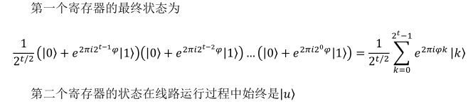

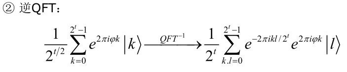

整体的估计精度应该表述为：

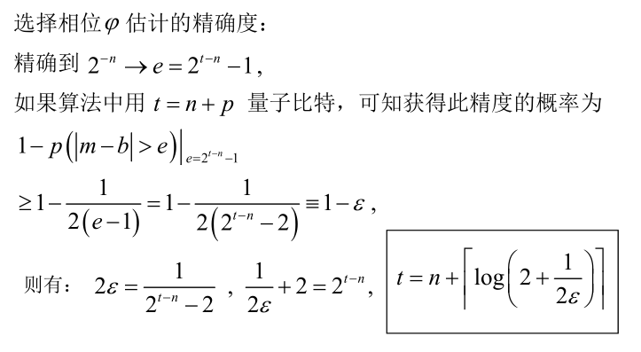

整体而言，有：

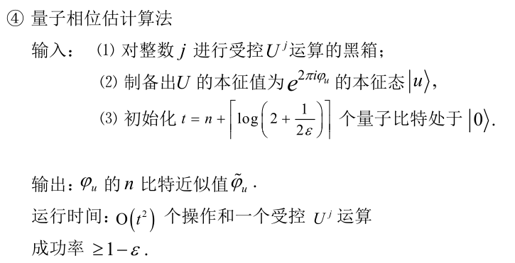

#### 离散对数量子算法举例

经典秘钥的操作：

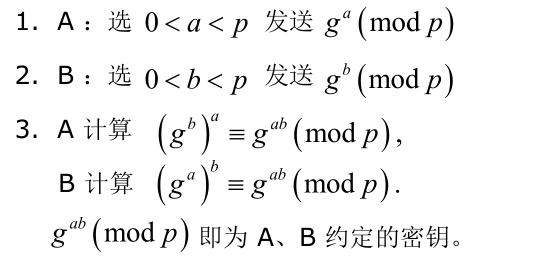

实际上，这个协议毫无安全性可言。 

对于离散对数问题，有：

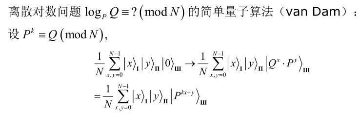

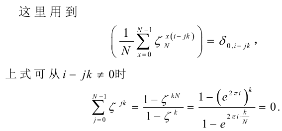

#### 求阶

求阶需要求的内容：

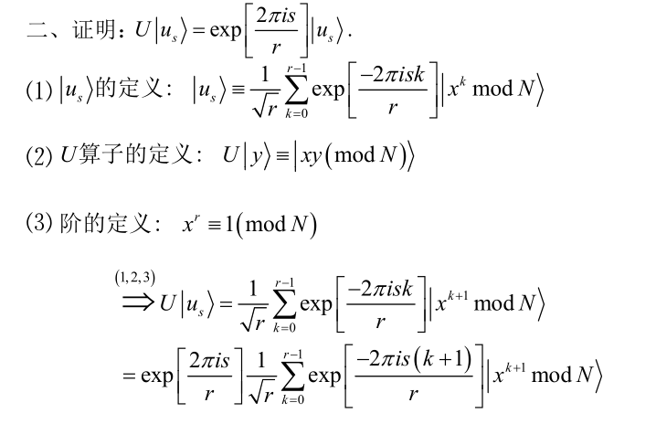

利用(1)(2)(3)式，容易证明上面的内容，那么具体求阶计算过程为：

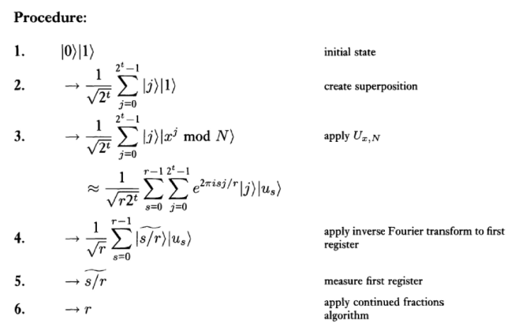

#### 因子分解

因子分解的具体问题为：

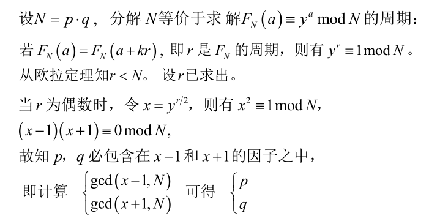

其具体的例子为：

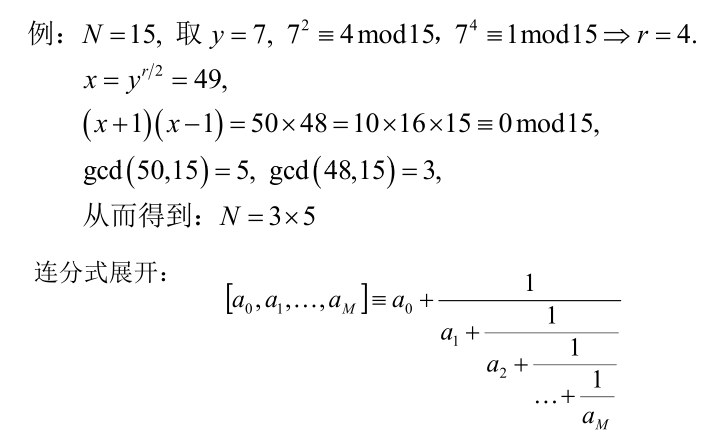

### Grover 量子搜索算法

无序数的快速搜索算法

#### $U_a$ 变换

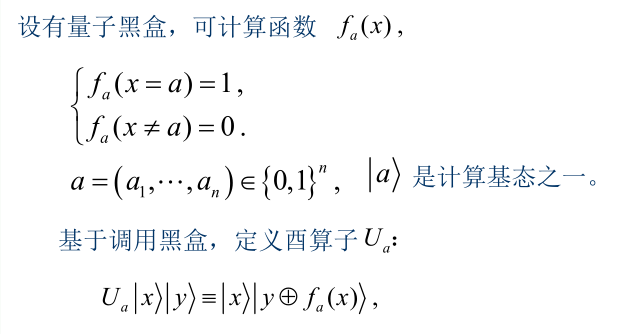

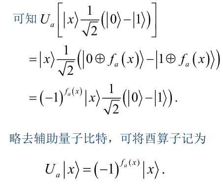

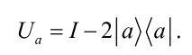

#### $U_s$变换

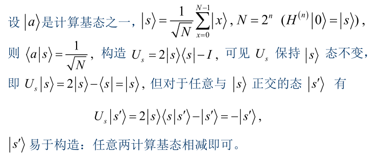

#### Grover 迭代

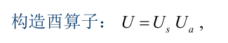

#### 从N 中到1 问题

迭代 多次使得最终的结果不断接近于以概率1 得到黑盒的 a 

#### 多搜索目标问题

#### 关于“量子摇晃”
