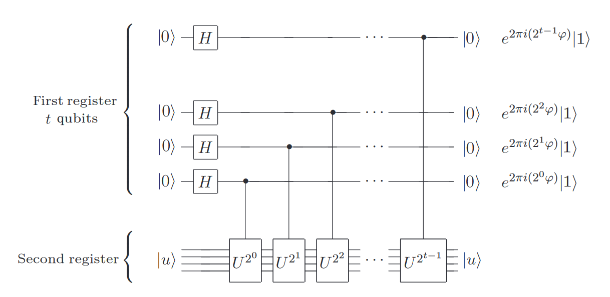

# 量子信息与量子密码 课程报告

# 从经典量子算法到量子机器学习

本报告主要探索了一些经典的量子计算的算法，以及其在典型的量子机器学习中的应用。 其中的部分算法是在课程汇中涉及到的，这里会进行一定的略过，并突出一些没有讲解过的经典算法，例如HHL 算法，并给出两个经典机器学习算法的量子实现（QPCA 和 QSVM），来分析这些基础算法在其中的应用。

## HHL 算法

### 相位估计

相位估计算法是课上已经讲解过的一个算法，其是许多量子算法的关键，其第一个阶段的框架如下：

总线路图如下所示： 

上述路线实现的变换为

最后在计算基下的测量将会给出$|\varphi>$的估计值。相位估计通过两个阶段实现，**第一阶段提取了目标酉算子的特征值放到了量子态的概率幅中，第二阶段提取了概率幅中的相位放到了量子态的基态中。**最终输出的就是估计的相位，由这个相位就可以进一步求出输入矩阵的特征值。 在相位估计中，实际上是通过QFT算法的逆运算，将量子态的概率幅值存储到基态中，以便通过后续测量得到相位值。

### Swap test

在课程中，介绍了经典的两个纯态量子之间进行交换的量子电路，如下图所示，其主要是用来计算内积模的平方，以表明两个纯量子态的接近程度。

其基本的计算过程如下所示： 

可以看到，用基态|0> 在最后测量为0的概率为 $\frac{1}{2}(1+|<\phi|\varphi>|^2)$，而用基态|1> 测量得到1的概率为$$\frac{1}{2}(1-|<\phi|\varphi>|^2)$。所以可以用这样的方法来计算内积。

而要进行混合态与纯态的swap test 操作，需要对混合态进行纯化操作，相较于上面的电路图而言，其具体为： 

可以看到，对于混合态的密度算子 $\rho = \sum_ip_i|\varphi_i><\varphi_i|$而言，附加一个系统R 对其进行纯化得到： 

$$
|\rho R> = \sum_i \sqrt{p_i}|\varphi_i>|i^{R_i}>
$$
而后的操作就和之前的swap test 操作是一致的。 

### HHL 算法

#### 基本框架

HHL 算法[1] 是在2009年由 Harrow 等人提出的一个经典量子算法，用于求解线性方程的问题。 **线性系统是很多科学和工程领域的核心**，由于**HHL算法\**在特定条件下\**实现了经典算法的\**指数加速\**效果**，能够在数据处理、机器学习、数值计算等场景具有广泛应用。

经典的求解线性方程的问题，一般表示为： 输入一个$n \times n$的矩阵 $A$ 和 一个$n$ 维向量b， 输出$n$维向量$x$， 满足$Ax=b$

对于HHL量子算法而言，对输入和输出有一定的限制，包括如下：

1） 对输入$A$ 和 $b$的要求： 首先要求$n \times n$ 的矩阵A是一个厄米矩阵，其次输入$b$是一个单位向量。 

2） 对输出$x$的形式的要求： 算法的输出如上图中电路最后一行所示，为$|x'>$，其依旧存放在底部寄存器中（即输出$x$ 和 输入$b$是在同一个寄存器中）。 底部寄存器存放的是一个蕴含了向量$x$的量子态。这里的“蕴含”的意思是我们并不能读出这个$x$的确切值是什么。不过我们能够得到一个关于x的整体特性，比如我们能够通过一个算子M，得到一个关于x期望值的一个评估：$x^{+}Mx$。

从上图中，我们可以清晰地看到，HHL算法有三个过程，分别是相位估计，受控旋转和逆相位估计。 在上一节中，已经说明了相位估计的基本方法，而逆相位估计，就是相位估计的逆运算。具体而言，可以将相位估计看做是一个基本的算子$U_{pe}$，相位估计的过程也就是得到$|\varphi> = U_{pe}|u>$ ，那么相位估计的逆运算，也就是将该算子求逆，并带入到具体的运算过程中。

#### 计算过程

下面来具体解析HHL 算法，根据上图的步骤来分析每步的计算(为了简化描述，将线路图中第一行附加量子比特称为第一寄存器，第二行称为第二寄存器，底部的第三行即输入|b>所在的寄存器称为第三寄存器。)：

**step 1. ** 在第三寄存器中，准备$ |b> = \sum_{i=1}^N b_i|i>$，其中$\vec{b} = (b_1, ..., b_N)$，且有$\sum_{i=1}^N|b_i|^2 = 1$ (根据前面提出的对输入的限制)

**step 2. **在最底部线路中，构建酉算子。将厄米矩阵$A$ 转换为酉操作$e^{iAt}$， 其中HHL 算法中还介绍了如何将一个非厄米矩阵转换为厄米矩阵的形式。 这里所构造的酉算子，就是这样的一个形式。 

**step 3. ** 通过相位估计，这也是前面介绍过的部分，在A 的特征空间上分解$|b>$，得到其结果为$|b> = \sum_{j=1}^N \beta_j|u_j>$，其中$|u_j>$是矩阵$A$ 的特征向量，对应的特征值为$\lambda_j$，具体而言，可以将矩阵$A$表示为如下的分解形式： $A = \sum_{i=1}^N \lambda_j |u_j> <u_j|$ 

**step 4. **如图中绿色方框所示，设计一个映射$R$，其是一个受控旋转操作，其基本的操作如下：将附加量子比特由基态$|0>$映射到$|0>$和$|1>$的叠加态上，同时到值提取到基态$|1>$的概率幅上，具体计算为： 
$$
R|0> = \sqrt{1-\frac{c^2}{\lambda_j^2}}|0> + \frac{c}{\lambda_j}|1> 
$$
其中$c = O(1/\kappa) \le min_j |\lambda_j|$。因此，在经过了step 4 之后，得到的量子寄存器态为 $\sum_{j=1}^N(\sqrt{1-\frac{C^2}{\lambda^2}}|0> + \frac{c}{\lambda_j}|1>)\beta_j|u_j>|\lambda_j>$。 

**step 5. ** 执行逆相位估计将 $|\lambda_j>$ 变为 $|0>$，并测量附加的量子比特，若测量的结果为$|1>$，那么得到该线性系统的计算值 $|x>$。 

## 量子搜索算法

### Grover 算法

Grover算法最早被用于在无序数据中搜索最大值、最小值问题[3]。Grover 算法在课程中已经清晰地说明过，这里就只作简单的介绍，不进行过多细节的深化。 

如上图所示，Grover 算法的基本执行过程主要是经过$\sqrt(N)$ 次G门，就可以以很大的概率找到需要寻找的那个值，这里不再对$\sqrt(N)$ 次G门之后，以多大概率能够区分搜索的值和其它值进行说明。  

其基本流程如下： 

首先对$n$量子比特的基态进行一个初始化操作，得到无序数据集合，一共有$2^n$个基态的均衡叠加态： 
$$
|\varphi> = \frac{1}{\sqrt{n}} \sum_{x=0}^{n-1}|x> 
$$
然后进行多次Grover 迭代，如图中G 部分所示。

Grover 迭代分为四步， 分别为：黑箱Oracle， 起到标记解的作用，对满足等式C(x) = 1 的 x 进行标记。 然后进行Hadamard 变换， 相位翻转 ， 然后再进行一次Hadamard 变换。 整个Grover 迭代过程可以标记为： 
$$
G = (2|\varphi> <\varphi| - I)O
$$
经过$O(\sqrt{N})$次Grover 迭代后进行测量，会以高概率得到要搜索的X。 

### Grover 算法的推广 —— AA 算法

AA（Amplitude Amplification) 算法[4]在Grover算法基础上做了推广，使其应用更加广泛。原始的Grover算法主要应用于搜索问题。推广的AA算法不仅可以提高经典算法的成功概率，也可以用于提高量子算法输出的成功概率。例如，该算法在很多HHL-based算法中都有应用。具体而言，假设量子算法输出满足$f(x = 1)$的$x$的概率为$a > 0$， 则经过$O(1/\sqrt(a))$ 次迭代，算法能够以一个很高的概率搜索到解$x$，其实现呢了经典算法的二次加速。 

 从计算的步骤上而言，两个算法具有很强的相似性， 下图展示了AA 算法的计算步骤，可以看到，相较于 Grover 算法而言， 其同样是一个首先进行初始化，然后迭代计算 Q 门的状态。 

接下来通过对比 Grover 算法 和 AA 算法，来说明AA 算法的基本计算流程： 

对于Grover 算法而言，其 G 门的计算逻辑可以表示为 $G = -HS_0HS_{\chi}$，而上图中AA算法中的迭代部分Q可以表示为：
$$
Q = Q(A, \chi) = -AS_0A^{-1}S_{\chi} \\
Q = Q(A, \chi, \phi, \varphi) = -AS_0(\phi)A^{-1}S_{\chi}(\varphi)
$$
可以看到，从上述公式的描述中，实际上Q 是G 的一般化过程，当算子A 为 Hadamard 门的时候， 那么就可以表示成Grover 算子的形式。 而在更一般的情况下，A可以是任意一个量子算法，将初始基态$|0>$ 转变为一个任意叠加态，具体可以表示为$A|0> = \sum_{x \in X} a_x|x> $。 

在公式中，另外两个值得注意的算子就是$S_0$ 和 $S_{\chi}$，在考虑给这两个算子添加可变角度之后，可以将这两个变换的函数表示为： 
$$
S_{\chi}(\varphi): |x> \rightarrow \begin{cases}  
e^{i\varphi|x>} & if \ \chi(x) = 1 \\
|x> & if \ \chi(x) = 0
\end{cases} \\ 
S_{0}(\phi): |x> \rightarrow \begin{cases}  
e^{i\phi|x>} & if \ x = 0 \\
|x> & if \ x \ne 0
\end{cases} \\
$$
对于一般化的$S_0$和$S_{\chi}$，其设置了$\phi=\varphi = \pi$，那么可以得到公式为如下： 
$$
S_{\chi}(\pi): |x> \rightarrow \begin{cases}  
-|x> & if \ \chi(x) = 1 \\
|x> & if \ \chi(x) = 0
\end{cases} \\ 
S_{0}(\pi): |x> \rightarrow \begin{cases}  
-|x> & if \ x = 0 \\
|x> & if \ x \ne 0
\end{cases} \\
$$
总体来看，AA 算法是对于Grover 算法的一般化，并从这种一般化的过程中，研究出了一些新的可适用的场景，这种思路是一个很好的研究思路。

## 量子主成分分析 (QPCA)

主成分分析 (PCA) 是一种常用的降维方式，在很多方面都有应用。 本章将首先介绍经典的PCA 算法，然后介绍量子主成分分析的实现。 

### 经典主成分分析算法

PCA 算法的目标是将高维数据投影到低维空间，具体而言，其寻找投影后的低维空间中的$r$个新变量，基本要求是要通过降维手段，将这些样本点的投影尽可能的分开，即投影后的样本点方差最大化。 其具体的推导过程如下。 

**数据：** 给定数据集 $X = (x_1, x_2, ... x_n)$，其中$x_i \in R^d$ 为 $d$维数据，为了后续计算的简化，不妨假设$\sum_{i=1}^nx_i = 0$ 

**目标：** 构造一个投影矩阵$P_{r \times d}$， 使得将原数据集投影到低维空间，投影方式为$Y = P^TX$，其中$Y = (y_1, y——2, ..., y_n), y_i \in R^r, r<d$。而根据最大化方差的基本目标，寻找这个投影算子$P$ 的优化目标应该是：
$$
\max_P tr(P^TXX^TP) \\
s.t. \ P^TP = I
$$
**求解：**对于该目标函数使用拉格朗日乘值法，可得到： 
$$
XX^TP = \lambda P
$$
因此，只需要对计算样本的协方差矩阵 $A = XX^T$ 进行特征分解，然后将求得的特征值进行排序，得到其排序为： 
$$
\lambda_1 \ge \lambda_2 \ge ... \ge \lambda_d
$$
再取前r个特征值对应的特征向量构成 $P = (p_1, ..., p_r)$

### 量子主成分分析算法

根据上文的介绍，实际上 PCA 的关键在于取协方差矩阵$A$的前$r$个最大特征值对应的特征向量来构造投影矩阵$P$,这里我们使用bra-ket 形式来进行描述，其可以构建为如下图所示的形式：

需要说明的是，QPCA [6] 并不是经典PCA 一个简单对应的量子版本，其具有其独特的研究背景和目标，主要是为了研究密度算子的特征向量和特征值，这也是在课程中多次涉及到的内容。

QPCA 的求解过程可以理解为矩阵的特征分解过程，在之前所讨论的算法中，相位估计能够有效求解矩阵的特征分解问题。在相位估计中，需要构造两个内容，即量子态和对应的受控U算子。 在QPCA中，这两个输入均由密度算子$\rho$来构造，具体构造为：

**量子态：** 即密度算子$\rho$ 本身，其在特征空间上的分解为：
$$
\rho = \sum_{i} r_i|\chi_i><\chi_i|
$$
**受控U 算子：** 构造受控的$e^{-i\rho t}$。假定能够复制得到$n$个密度算子$\rho$，则可以构造得到受控的酉算子U。 其构造方式如下所示

具体而言，其借助密度算子$\rho$的$n$个复制和稀疏的交换矩阵$S$，通过偏迹运算实现$e^{-i\rho t}$的构造。进一步的，在相位估计中，执行的是受控酉算子。在QPCA[6] 中，提出了使用受控Swap 来代替原始的Swap 操作，从而解决了这一问题。 

因此，QPCA 的过程如下图所示，其本质上就是一个相位估计的内容。

根据计算图的描述，最终的相位估计会输出的结果为
$$
\sum_i r_i|\chi_i><\chi_i| \otimes |\tilde{r_i}><\tilde{r_i}|
$$
综上，QPCA借助相位估计便可分解出密度算子ρ的特征值和特征向量，从而实现了降维的操作。 实际上，在QPCA的文章中指出，这个算法不仅仅用于求解经典PCA，也可以用于进行量子态层析，量子态的区分和分配问题等。

## 量子支持向量机（QSVM）

### 经典支持向量机

支持向量机（SVM）是传统机器学习中，基于监督学习算法来解决分类问题的一个经典的算法，当然，在一定的条件下，SVM 算法也可以用于回归问题。本小节主要说明SVM 算法的计算过程。 SVM 的目标是寻找一个最好的区分两类数据的超平面，并提供一个决策边界。下面以最简单的二分类问题，说明经典的SVM 算法的求解过程。 

**数据：** 对于一个二分类问题，假设其共有N个样本，表示为$x_i$，其对应的标签为$y_i$，其中用$y_i = 1$和$y_i = -1$来分别表示这两类。其目标是最大化两种类别之间的距离。 

**目标与对偶问题：**根据SVM求解的目标，即最大化两种类别之间的距离，将其描述为如下形式：
$$
\min_{w,b} \frac{1}{2} ||w||^2 \\
s.t. y_j(w\cdot x_j + b) \ge 1
$$
对于原问题的求解，是困难的，将其转换为对偶问题，表示为：
$$
\max_\alpha \min_{w,b} L(w,b, \alpha) = \frac{1}{2} ||w||^2 - \sum_{i=1}^N y_j\alpha_j(y_j(w\cdot x + b) - 1)  \\
s. t. \quad y_j\alpha_j \ge 0
$$
进一步地，会有：
$$
\max_{\alpha} L(\alpha) = \sum_{i=1}^N y_j\alpha_j - \frac{1}{2}\sum_{j,k=1}^N \alpha_j K_{jk}\alpha_k \\ 
s.t. \quad \sum_{j=1}^N\alpha_j = 0, \quad y_j\alpha_j \ge 0  \\
K_{jk} = k(x_j, x_k) = x_j \cdot x_k 
$$

### QSVM 算法的实现

QSVM [5] 算法是在SVM 算法的基础上，对于原有的计算过程的改进，其主要的改进如下图所示： 

在经典的SVM 实现中，对于$\alpha$的求解过程需要涉及到核函数的计算，也就是样本之间的内积操作。在上文的分析中，我们给出了利用swap-test 方法实现的内积运算的加速操作，对于经典的内积操作，其时间复杂度为$O(N)$， 而基于swap-test 实现的内积操作，其时间复杂度仅为$O(logN)$，实现了指数级的加速。

在求得了内积之后，就是要求解了$\alpha$ ，对于$\alpha$的求解，本身是一个二次规划问题，在这里文章没有对原始SVM 进行分析，而是对最小二乘支持向量机LSSVM 的求解进行了分析，具体如下。 

对于SVM 的初始约束条件，可以进行如下的转换： 
$$
y_j(w\cdot x_j + b) \ge 1 \rightarrow w \cdot x_j + b = y_j - y_je_j \\
y_j = \pm 1
$$
在这里，引入了一个松弛变量$e_j$，将不等式约束转变为了等式约束。 通过这样的转换，使得求解$\alpha$ 的问题从二次规划变成了求解线性方程组的问题。而在之前的讨论中，我们已经说明了，使用HHL 算法可以对于求解线性方程组实现指数级别的加速。该问题的实际计算过程为：

下面展示整个算法的训练和推理流程：

上图给出了训练过程，可以看到，其训练过程主要就是对于之前所讨论的F的估计，通过得到一个好的F，来实现最终的优化，其具体线路和HHL 是类似的。 在上述过程中，重点使用到了我们介绍的HHL 和 AA 算法。 

而对于推理过程，其就是对于内积进行求解，重点使用了介绍的swap test 来实现向量内积的计算模式。

通过量子算法，对于这两个过程的计算都实现了指数级别的加速。 

## 总结

在本课程报告中，首先介绍了一些经典的量子算法，并说明如何利用这些算法求解量子机器学习问题。量子机器学习是量子计算中一个极具吸引力的领域，在一些经典的机器学习算法上，利用量子算法进行改写，已经证明了可以实现指数级别的加速。 而如何将两者有机的结合，还是需要回归到一些基本的量子算法上，并通过恰当的构造，得到一个好的实现。 

**参考文献**

[1] Harrow A W, Hassidim A, Lloyd S. Quantum algorithm for linear systems of equations[J]. Physical review letters, 2009, 103(15): 150502.

[2]quantum algorithm for data fitting PRL 109,050505(2012)

[3] Durr C, Hoyer P. A quantum algorithm for finding the minimum[J]. arXiv preprint quant-ph/9607014, 1996.

[4] Brassard G, Hoyer P, Mosca M, et al. Quantum amplitude amplification and estimation[J]. Contemporary Mathematics, 2002, 305: 53-74.

[5] Patrick Rebentrost, Masoud Mohseni, and Seth Lloyd. Quantum Support Vector Machine for Big Data Classification, Physical Review Letters, 113, 130503 (2014). 

[6] Lloyd S, Mohseni M, Rebentrost P. Quantumprincipal component analysis[J]. Nature Physics, 2014, 10(9): 631.

[7] Lloyd, S., Mohseni, M. & Rebentrost, P. Quantum algorithms for supervised and unsupervised machine learning. 
